# `NestJS: The Complete Developer's Guide`

<p align="center">
  <a href="http://nestjs.com/" target="blank"></a>
</p>

[circleci-image]: https://img.shields.io/circleci/build/github/nestjs/nest/master?token=abc123def456
[circleci-url]: https://circleci.com/gh/nestjs/nest

  <p align="center">A progressive <a href="http://nodejs.org" target="_blank">Node.js</a> framework for building efficient and scalable server-side applications.</p>
    <p align="center">
<a href="https://www.npmjs.com/~nestjscore" target="_blank"></a>
<a href="https://www.npmjs.com/~nestjscore" target="_blank"></a>
<a href="https://www.npmjs.com/~nestjscore" target="_blank"></a>
<a href="https://circleci.com/gh/nestjs/nest" target="_blank"></a>
<a href="https://coveralls.io/github/nestjs/nest?branch=master" target="_blank"></a>
<a href="https://discord.gg/G7Qnnhy" target="_blank"></a>
<a href="https://opencollective.com/nest#backer" target="_blank"></a>
<a href="https://opencollective.com/nest#sponsor" target="_blank"></a>
  <a href="https://paypal.me/kamilmysliwiec" target="_blank"></a>
    <a href="https://opencollective.com/nest#sponsor"  target="_blank"></a>
  <a href="https://twitter.com/nestframework" target="_blank"></a>
</p>

---

### Table of Contents

| No. | Section                                                                                   |
| --- | ----------------------------------------------------------------------------------------- |
| 1   | [Course Introduction](#section-1-course-introduction)                                     |
| 2   | [Scratch](#section-2-scratch)                                                             |
| 3-5 | [NEST CLI: CRUD generator](#section-3-5-nest-cli-crud-generator)                          |
| 6   | [Modules, Dependency Injection](#section-6-modules-dependency-injection)                  |
| 7   | [Car Value Project](#section-7-car-value-project)                                         |
| 8-9 | [Persisting Data with TypeORM in Nest](#section-8-9-persisting-data-with-typeorm-in-nest) |
| 10  | [Custom Data Serialization](#section-10---custom-data-serialization)                      |
| 11  | [Authentication From Scratch](#section-11-authentication-from-scratch)                    |
| 12  | [Unit Testing](#section-12-unit-testing)                                                  |
| 13  | [Integration Testing](#section-13-integration-testing)                                    |
| 14  | [Managing App Configuration](#section-14-managing-app-configuration)                      |
| 15  | [Relations with TypeORM](#section-15-relations-with-typeorm)                              |

---

# `Section-1: Course Introduction`

- This repository contains the entire NestJs learning journey that is created By (**`Stephen Grider`**).
- Build full featured backend APIs incredibly quickly with Nest.
- TypeORM, and Typescript. Includes testing and deployment!.
- Deploy a feature-complete app to production
- Write integration and unit tests to ensure your code is working
- Use an API client to manually test your app
- Make your code more reusable and testable with dependency injection
- Use decorators to dramatically simplify your code
- Build authentication and permissions systems from scratch
- Tie different types of data together with TypeORM relationships
- Use Guards to prevent unauthorized users from gaining access to sensitive data
- Model your app's data using TypeORM entities

## `FAQ`

#### `Where can I find this course??`

You can find it on Udemy here: [NestJS - Stephen Grider - Udemy](https://www.udemy.com/course/nestjs-the-complete-developers-guide)

---

# `Section-2: Scratch`

## 1- Package Dependencies

| ^   | Install Package                 | Description                                                                 |
| :-- | :------------------------------ | --------------------------------------------------------------------------- |
| 1   | @nestjs/common@7.6.17           | `Contains vast majority of functions, classes, etc, that we need from NEST` |
| 2   | @nestjs/core@7.6.17             | ` `                                                                         |
| 3   | @nestjs/platform-express@7.6.17 | `Lets Nest use ExpressJs for handling http requests`                        |
| 4   | reflect-metadata@0.1.13         | `Helps make decorators work.`                                               |
| 5   | typescript@4.3.2                | `We write nest apps with typescript`                                        |

---

## 2- Typescript Compiler options

```json
{
  "compilerOptions": {
    "module": "CommonJS",
    "target": "es2017",
    "experimentalDecorators": true,
    "emitDecoratorMetadata": true
  }
}
```

---

## 3- Create nest module and controller


## Start the Nest app

```bash
$ npx ts-node-dev src/main.ts
```

## Naming Convention


## **[⬆ Back to Top](#table-of-contents)**

---

# `Section 3-5: NEST CLI: CRUD generator`

## 1- Create Nest Project

```bash
$ nest new <name> [options]
// <name>	The name of the new project
```

- Generate a module **`(nest g mo)`** to keep code organized and establish clear boundaries (grouping related components)
- Generate a controller **`(nest g co)`** to define CRUD routes (or queries/mutations for GraphQL applications)
- Generate a service **`(nest g s)`** to implement & isolate business logic
- Generate an entity class/interface to represent the resource data shape
- Generate Data Transfer Objects (or inputs for GraphQL applications) to define how the data will be sent over the network

## Pipes

## Validation Pipe


## Automatic Validation


## `Finally to use pipe to validate body data in our project, we have some small steps:`

- Tell nest to use global validation, HOW?

  ```ts
  import { ValidationPipe } from "@nestjs/common";
  app.useGlobalPipes(new ValidationPipe());
  ```

  > > in 'main.ts' file we import ValidationPipe from common. then we use it inside bootstrap function:

- Create A DTO Class inside dtos folder for required validation: Call it for example: "CreateMessageDto" and use some npm packages [class-validator](https://github.com/typestack/class-validator) and [class-transformer](https://github.com/typestack/class-transformer) to make use of decorators to validate your fields.

  ```ts
  # dtos/create-message-dto.ts
  import { IsString } from 'class-validator';
  export class CreateMessageDto {
    @IsString()
    content: string;
  }
  ```

- Inside your controller go to the post method and make the body to be a dto object .

  ```ts
  import { CreateMessageDto } from './dtos/create-message-dto';
  @Post()
    createMessage(@Body() body: CreateMessageDto) {
      console.log(body);
    }
  ```

---

## Difference between Service and Repository

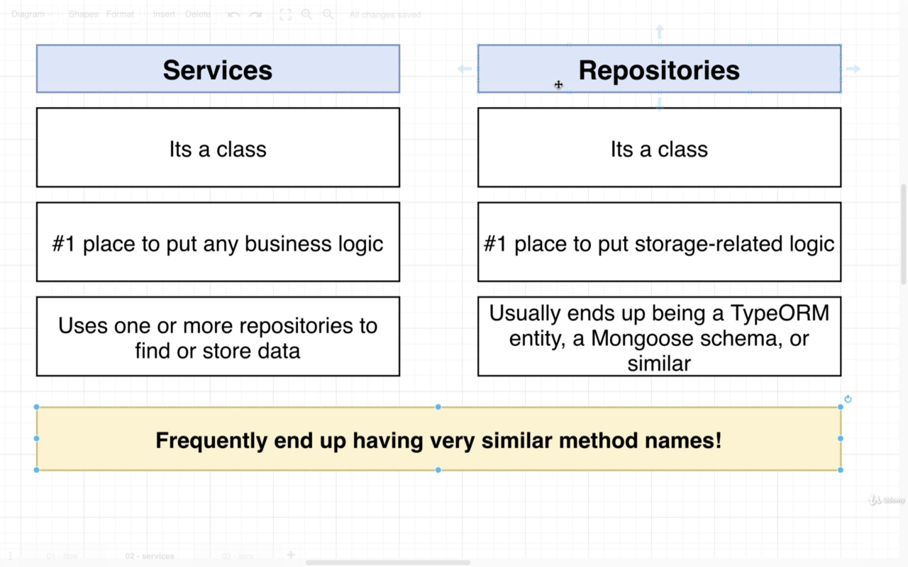


- Read this

  - [NestJS with TypeORM: When using custom repository, is a service needed anymore?](https://stackoverflow.com/questions/52030009/nestjs-with-typeorm-when-using-custom-repository-is-a-service-needed-anymore)
  - [Implementing a Generic Repository Pattern Using NestJS
    ](https://betterprogramming.pub/implementing-a-generic-repository-pattern-using-nestjs-fb4db1b61cce)

---

## ` Dependency Injection in our project between (controller-service-repository)`

> Never Do this
>
> > **BAD**: Message Service creates its own copy of MessagesRepository

```ts
export class MessagesService {
  messagesRepo: MessagesRepository;
  constructor() {
    // DO NOT DO THAT in real apps: use Dependency Injection
    this.messagesRepo = new MessagesRepository();
  }
}
```

> **Lets Solve this with Dependency Injection.**

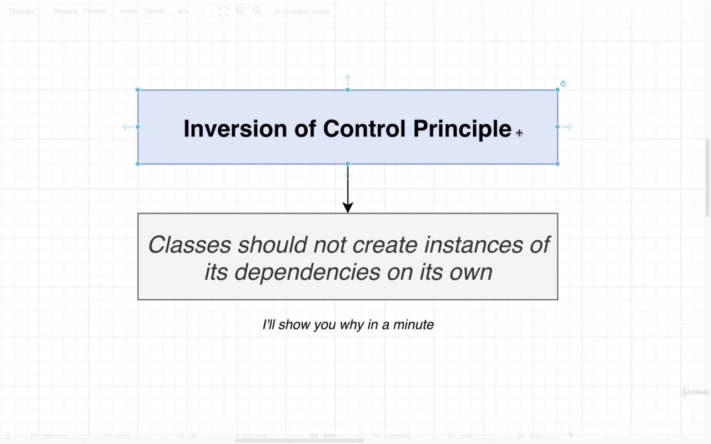

> Instead, Do this
>
> > **Better**: MessagesService receives its dependency.

```ts
export class MessagesService {
  messagesRepo: MessagesRepository;
  constructor(repo: MessagesRepository) {
    this.messagesRepo = repo;
  }
}
```

## BEST SOLUTION: REPOSITORY PATTERN

> Read this First: [Implementing a Generic Repository Pattern Using NestJS](https://betterprogramming.pub/implementing-a-generic-repository-pattern-using-nestjs-fb4db1b61cce)

> MessagesService receives its dependency, and it doesn't specifically required 'Message Repository' you can change your datasource in a flexible way.

```ts
interface Repository {
  findOne(id: string);
  findAll();
  create(content: string);
}
export class MessagesService {
  messagesRepo: Repository;
  constructor(repo: Repository) {
    this.messagesRepo = repo;
  }
}
```


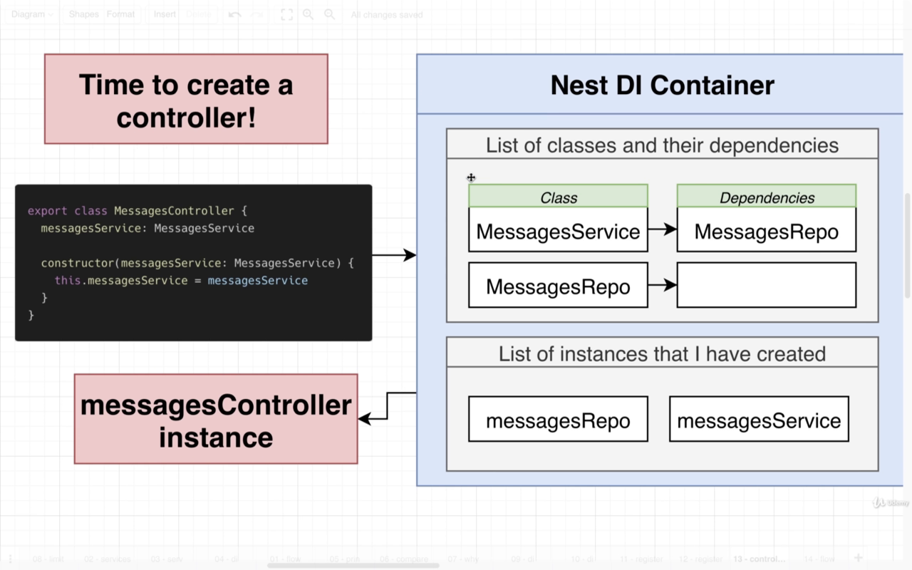


## Few more notes about DI

- ` Stephen Grider says:`

> last thing I want to touch on is the fact that as you start to look at this code, you might really start to say, what is the benefit? What have we really gained here? What is the big benefit to all the stuff we've done? Who cares about using dependency injection? Well, to be honest with you, sometimes I kind of agree with you not going to lie. Sometimes in invest making use of dependency injection feels like we are just kind of jumping through extra hoops without really gaining a whole lot.

> So if you feel that way, totally fine. But I can't tell you without a doubt, is that testing your application when you're making use of dependency injection and its entire inversion of control technique, testing your app is going to be far easier, a lot easier. So eventually when we start writing tests around our application, we're going to see that testing individual classes inside of our app is going to be very simple and straightforward compared to if we were not making use of inversion of control and dependency injection. So just keep in mind that is really the payout. The payout of all this stuff is once we start writing tests. So that's kind of got a corollary to it, I'm assuming that you are interested in testing and you want to do testing.

---

## **[⬆ Back to Top](#table-of-contents)**

---

# `Section-6: Modules, Dependency Injection`

## Project Structure

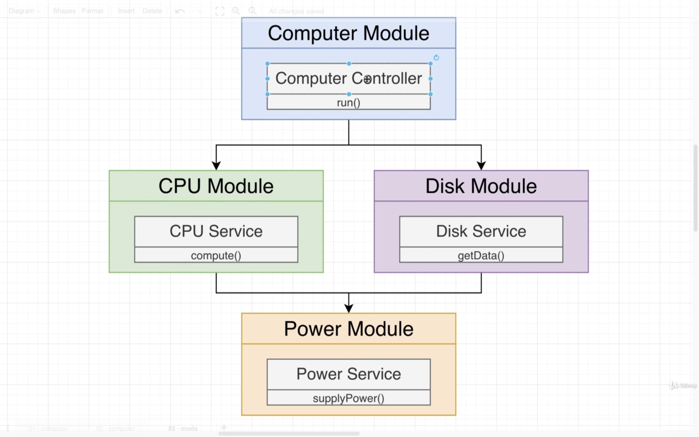

## 1- Create Nest Project

```bash
$ nest new di
```

## 2-Generate four modules by cli: [computer, cpu, power, disk]

```bash
$ nest genrate module $(name)
```

## 3-Generate three services by cli: [cpu, power, disk]

```bash
$ nest genrate service $(name)
```

## 4-Generate The computer controller

```bash
$ nest genrate controller computer
```

## `Share code between different modules.`


## `DI inside one single module`


## `DI between different modules`


## `Wrap Up`


---

## **[⬆ Back to Top](#table-of-contents)**

---

# `Section-7: Car Value Project`

## Project Structure

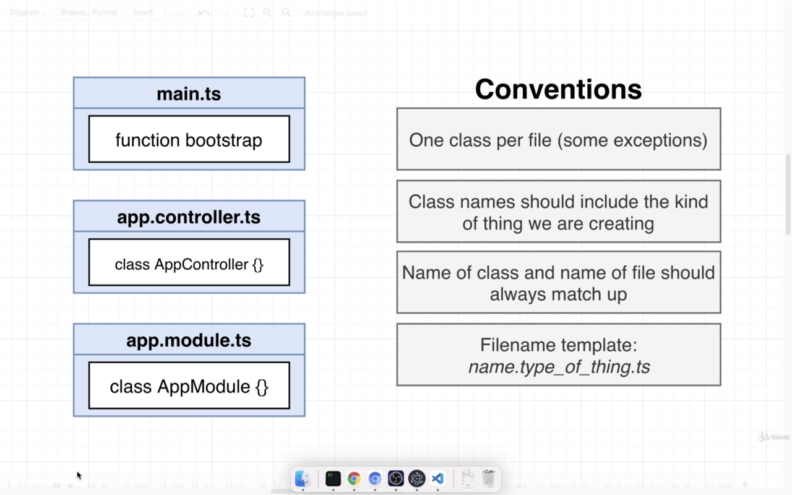

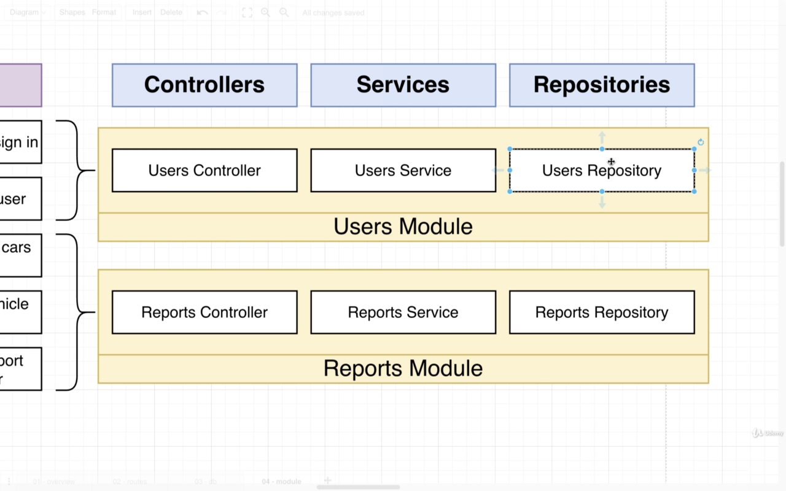

## **[⬆ Back to Top](#table-of-contents)**

---

# `Section-8-9: Persisting Data with TypeORM in Nest`


## How to create an entity ?

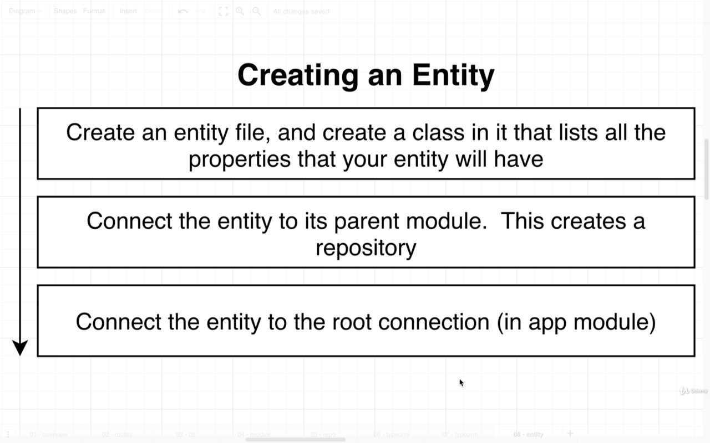

```ts
//1) create user.entity.ts

import { Entity, Column, PrimaryGeneratedColumn } from "typeorm";

@Entity()
export class User {
  @PrimaryGeneratedColumn()
  id: number;

  @Column()
  email: string;

  @Column()
  password: string;
}
```

```ts
//2) update users.module.ts
+ import { TypeOrmModule } from '@nestjs/typeorm';
+ import { User } from './user.entity';
@Module({
  + imports: [TypeOrmModule.forFeature([User])],
})
export class UsersModule {}
```

```ts
//3) update parent: app.module.ts
+ import { User } from './users/user.entity';
@Module({
  imports: [
    TypeOrmModule.forRoot({
      type: 'sqlite',
      database: 'db.sqlite',
    + entities: [User],
      synchronize: true,
    }),
    UsersModule,
    ReportsModule,
  ],
  controllers: [AppController],
  providers: [AppService],
})
export class AppModule {}
``
```

## `TypeOrm: Repository Api`

> More about: [Repository Api](https://typeorm.io/repository-api)


## `How to call the repository api and dependency injection in our service ?`


```ts
//1) Update users.service.ts

+ import { Repository } from 'typeorm';
+ import { InjectRepository } from '@nestjs/typeorm';
+ import { User } from './user.entity';

@Injectable()
export class UsersService {
  + constructor(@InjectRepository(User) private repo: Repository<User>) {}
  //this @InjectRepository(User) for purpose of dependency injection with generics.

  create(email: string, password: string) {
    const user = this.repo.create({ email, password });
    return this.repo.save(user);
  }
}

//2) Update users.controller.ts

+ import { UsersService } from './users.service';

@Controller('auth')
export class UsersController {
  + constructor(private usersService: UsersService) {}
  @Post('/signup')
  createUser(@Body() body: CreateUserDto) {
    + this.usersService.create(body.email, body.password);
  }
}

```

> No hooks works in save api.


## **[⬆ Back to Top](#table-of-contents)**

---

# `Section 10 - Custom Data Serialization`

### How to hide data in Nest

#### 1- Nest Recommended Solution

1. In 'user.entity.ts'

```ts
+ import { Exclude } from 'class-transformer';
```

```ts
  // Add Exclude Decorator to the field that it must be hidden.
  + @Exclude()
  @Column()
  password: string;
```

2. In 'user.controller.ts'

```ts
import { UseInterceptors, ClassSerializerInterceptor } from "@nestjs/common";
```

```ts
// Add this decorator in your route.
+ @UseInterceptors(ClassSerializerInterceptor)
  @Get('/:id')
  async findUser(@Param('id') id: string) {
    const user = await this.usersService.findOne(+id);
    if (!user) {
      throw new NotFoundException('User not found');
    }
    return user;
  }

```

#### 2- More Complicated (much more flexible) Solution.

> [What's the difference between Interceptor vs Middleware vs Filter in Nest.js?](https://stackoverflow.com/questions/54863655/whats-the-difference-between-interceptor-vs-middleware-vs-filter-in-nest-js)

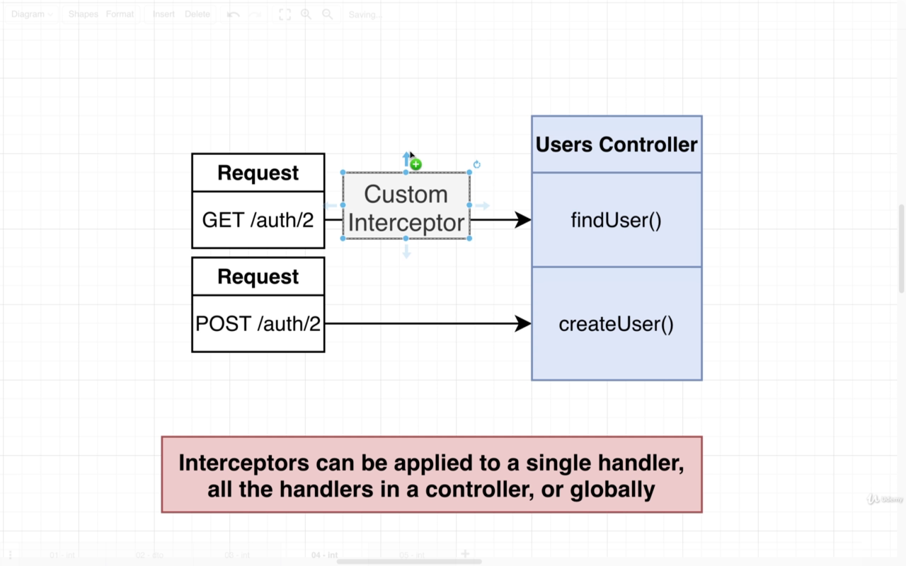


##### Our First Interceptor

> create new interceptor 'serialize.interceptor.ts'

```ts
import {
  UseInterceptors,
  NestInterceptor,
  ExecutionContext,
  CallHandler,
} from "@nestjs/common";
import { Observable } from "rxjs";
import { map } from "rxjs/operators";
import { plainToClass } from "class-transformer";

export class SerializeInterceptor implements NestInterceptor {
  intercept(
    context: ExecutionContext,
    handler: CallHandler<any>
  ): Observable<any> | Promise<Observable<any>> {
    return handler.handle().pipe(
      map((data: any) => {
        return plainToInstance(this.dto, data, {
          excludeExtraneousValues: true,
        });
      })
    );
  }
}
```

> create new decorator to make use of our interceptor

```ts
export function Serialize(dto: any) {
  return UseInterceptors(new SerializeInterceptor(dto));
}
```

> Use it in our route or, or in our controller

```ts
@Serialize(UserDto)
@Get('/:id')
findUser(){}
```

### `How to make decorator accepts a class only ? (type safety)`

> to avoid this @Serialize('Hello World')
>
> > Use interface for class definition

```ts
interface ClassConstructor {
  new (...args: any[]): {};
}
function Serialize(dto: ClassConstructor){...}
```

---

## **[⬆ Back to Top](#table-of-contents)**

---

# `Section-11: Authentication From Scratch`

### Create new Service 'Auth Service' to split out the authentication process from user service.

#### This is the module after adding Auth Service.


> Create a new service class and inject it to the module 'auth.service.ts'
>
> > Then it will be able to use UserService as a di.

```ts
// auth.service.ts

import { Injectable } from "@nestjs/common";

@Injectable()
export class AuthService {
  constructor(private usersService: UsersService) {}
}
```

```ts
// users.module.ts
@Module({
  + providers: [UsersService, AuthService],
})
export class UsersModule {}
```

### Signup flow : Hashing password with Salt.


> Signup functionality in the auth service class.

```ts
export class AuthService {
  async signup(email: string, password: string) {
    // Check if user email in use
    const users = await this.usersService.find(email);
    if (users.length) {
      throw new BadRequestException("This email is already use.");
    }

    // Hash the user password
    // First: Generate the Salt
    const salt = randomBytes(8).toString("hex");

    // Hash the salt and the password together using scrypt function as a buffer.
    const hash = (await scrypt(password, salt, 32)) as Buffer;

    // Join the hashed result and the salt together.
    // you will split it in the sign in function to get the salt and hash.
    // then with the login password you will hash it again with the given salt.
    // then compare them if they equal = Authenticated user.
    const result = `${salt}.${hash.toString("hex")}`;

    // Create a new user and save it
    const user = await this.usersService.create(email, result);

    // return created user.
    return user;
  }

  async signin(email: string, password: string) {
    // Check if user email exist.
    const [user] = await this.usersService.find(email);
    if (!user) {
      throw new BadRequestException("This email not exist.");
    }

    // Check if password is correct.
    const [salt, storedHash] = user.password.split(".");
    const hash = (await scrypt(password, salt, 32)) as Buffer;
    if (storedHash !== hash.toString("hex")) {
      throw new BadRequestException("Wrong Password.");
    }

    return user;
  }
}
```

## Common Auth System Features.


### How to create your own custom Param Decorator

```ts
import { createParamDecorator, ExecutionContext } from "@nestjs/common";

export const CurrentUser = createParamDecorator(
  (data: any, context: ExecutionContext) => {
    return "Current User Custom Decorator";
  }
);
```

### Now, to make a Decorator to use to get current user, we need two things

1. Session object to get the current userId, easy with context object.
1. UserService class to get access to repo, hard because the dependency injection system.

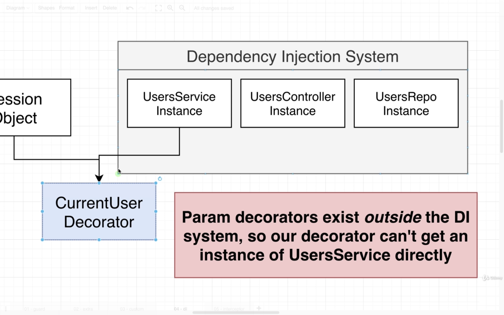

### `Solution for this problem: Create an Interceptor to hold those things, and make it inside di container and then decorator can use it.`

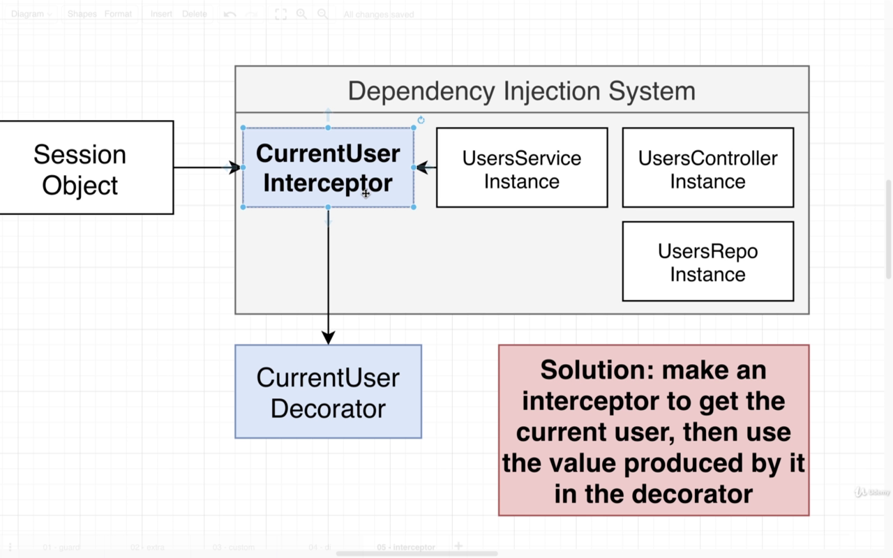

## How to connect our create-user interceptor to controllers

### 1- Controller Scoped.

> ### Hint, Very tedious if we will use this interceptor in more than one controller.


## Steps:

> 1- Create Interceptor to add the current user to the request.

```ts
import {
  NestInterceptor,
  ExecutionContext,
  CallHandler,
  Injectable,
} from "@nestjs/common";
import { Observable } from "rxjs";
import { UsersService } from "../users.service";

@Injectable()
export class CurrentUserInterceptor implements NestInterceptor {
  constructor(private userService: UsersService) {}
  async intercept(
    context: ExecutionContext,
    handler: CallHandler
  ): Promise<Observable<any>> {
    const request = context.switchToHttp().getRequest();
    const { userId } = request.session;

    if (userId) {
      const user = await this.userService.findOne(+userId);
      request.currentUser = user;
    }

    return handler.handle();
  }
}
```

> 2- Inject the interceptor to the providers of 'users.module.ts'

```ts
//users.module.ts
@Module({
  ...,
  providers: [..., CurrentUserInterceptor],
});
```

> 3- Use the interceptor in our controller.

```ts
//users.controller.ts
@UseInterceptors(CurrentUserInterceptor)
export class UsersController {}
```

### 2- Globally Scoped.

> ### Only single instance to all controllers.


#### How to apply it globally?

```ts
// in users.module.ts

+ import { APP_INTERCEPTOR } from '@nestjs/core';

@Module({
  ...,
  providers: [
    ...,
    {
      provide: APP_INTERCEPTOR,
      useClass: CurrentUserInterceptor,
    },
  ],
})
export class UsersModule {}
```

---

## How to make a `Guard`: to reject requests to certain handlers if the user is not signed in.

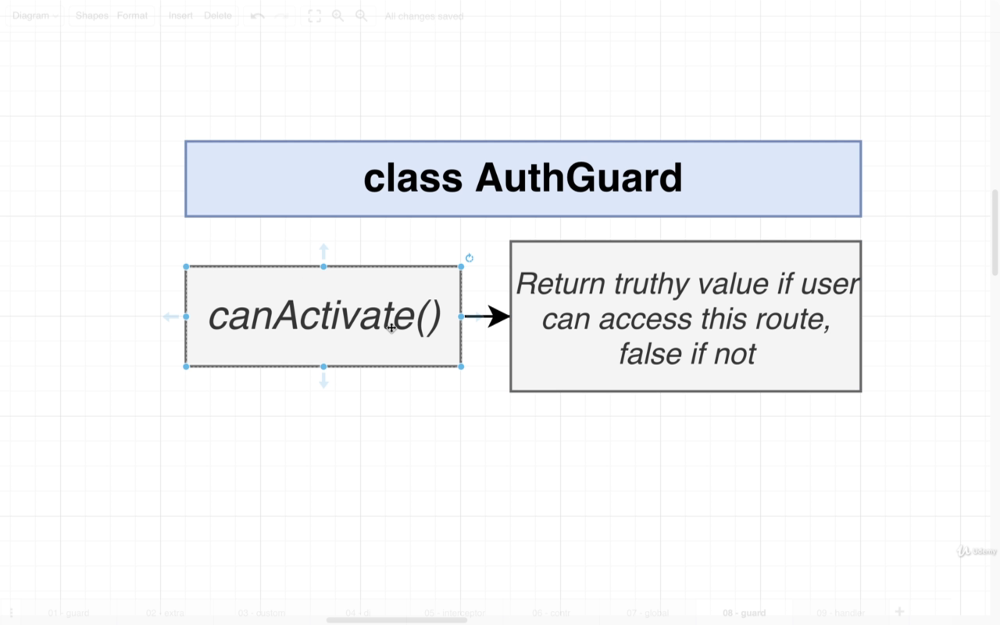

### As well as interceptors: we can apply guard in different locations:

1. Globally for all controllers.
1. Controller scope.
1. Single Handler Scope.


### Steps to make our AuthGuard.

> 1- Make your guard dir, and create 'auth.guard.ts'

```ts
import {
  CanActivate,
  ExecutionContext,
  UnauthorizedException,
} from "@nestjs/common";

export class AuthGuard implements CanActivate {
  canActivate(context: ExecutionContext) {
    const request = context.switchToHttp().getRequest();
    const { userId } = request.session;

    if (!userId) {
      throw new UnauthorizedException(
        "Your are not authorized for this resource."
      );
    }

    return userId;
  }
}
```

> 2- In our controller:

```ts
import { UseGuards } from "@nestjs/common";
import { AuthGuard } from "../guards/auth.guard";
// @UseGuards(AuthGuard) // apply guard for controller
export class UsersController {
  @Get("/whoami")
  @UseGuards(AuthGuard) // apply guard for single handler
  whoAmI(@CurrentUser() user: User) {
    return user;
  }
}
```

---

## **[⬆ Back to Top](#table-of-contents)**

---

# `Section-12: Unit Testing`


## To make test of our 'Auth Service' functionality (signup, signin) we should have:

1. A Copy of UsersService to use [find(), create()].
1. The UsersService depends on 'UsersRepo', So it should have copy of it.
1. The UsersRepo depends on 'SQLITE' and its configuration.

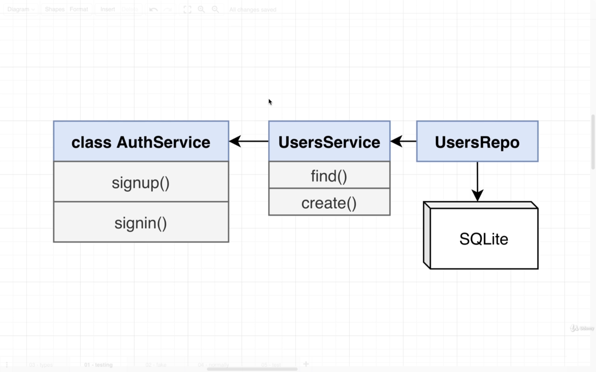

## To make our test more straightforward we will use a trick

### We're going to use the `dependency injection` system to avoid having to create all these different dependencies.

### `Create your own fake 'UsersService'`


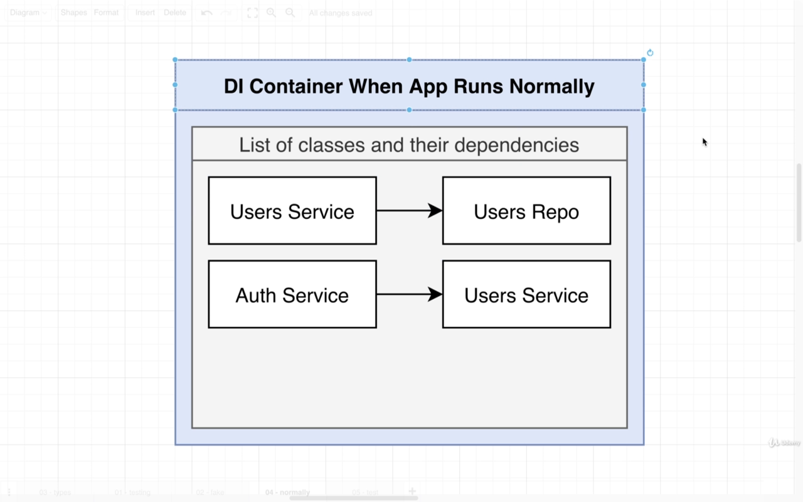


```ts
import { Test } from "@nestjs/testing";
import { AuthService } from "./auth.service";
import { User } from "./user.entity";
import { UsersService } from "./users.service";

it("can create an instance of auth service", async () => {
  //Create a fake copy of users service.
  const fakeUsersService: Partial<UsersService> = {
    find: () => Promise.resolve([]),
    create: (email: string, password: string) =>
      Promise.resolve({ id: 1, email, password } as User),
  };
  const module = await Test.createTestingModule({
    providers: [
      AuthService,
      {
        provide: UsersService,
        useValue: fakeUsersService,
      },
    ],
  }).compile();

  const service = module.get(AuthService);

  expect(service).toBeDefined();
});
```


---

## **[⬆ Back to Top](#table-of-contents)**

---

# `Section-13: Integration Testing`

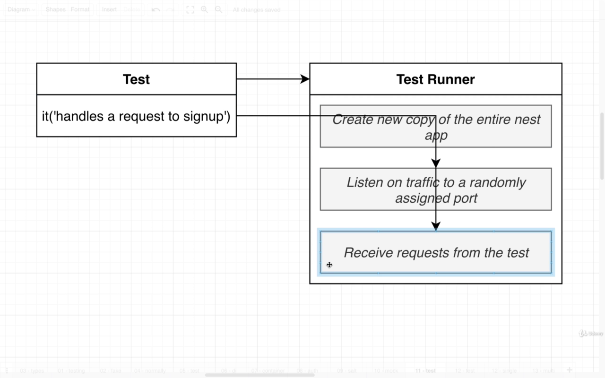


### To solve the problem of : 'Test module cannot use session or pipe because these are created in main.ts file not in the app module... We can do this: '

> ## First the ValidationPipe.

1. ### Remove uses in the main.ts file

```ts
// Remove this block of code in bootstrap function >> main.ts
app.useGlobalPipes(
  new ValidationPipe({
    whitelist: true,
  })
);
```

2. ### Add new provider in AppModule file.

```ts
import { ValidationPipe } from '@nestjs/common';
import { APP_PIPE } from '@nestjs/core';

providers: [
    ...,
    {
      provide: APP_PIPE,
      useValue: new ValidationPipe({ whitelist: true }),
    },
  ],
```

> ## Second, Globally Scoped Middleware: 'Cookie-Session'.

1. ### Remove uses in the main.ts file

```ts
// Remove this block of code in bootstrap function >> main.ts
app.use(
  cookieSession({
    keys: ["secret-key"],
  })
);
```

2. ### Create new method in AppModule Class.

```ts
export class AppModule {
  configure(consumer: MiddlewareConsumer) {
    consumer.apply(cookieSession({ keys: ["secret-key"] })).forRoutes("*");
  }
}
```

### `Create two versions of our DB , one for development and another one for testing.`


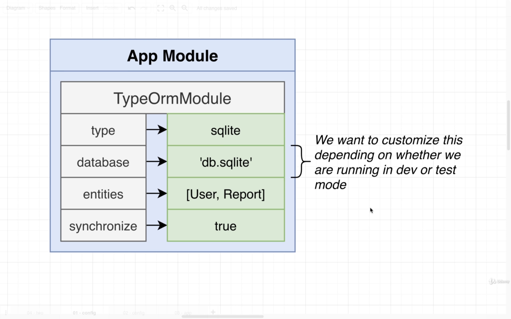

> #### You can solve this by using NODE_ENV variable to identify which environment you work on.

```ts
    TypeOrmModule.forRoot({
      type: 'sqlite',
    + database: process.env.NODE_ENV === 'test' ?
      'test.sqlite' : 'db.sqlite',
      ...
    }),
```

## Recommended Solution: Environment Config.

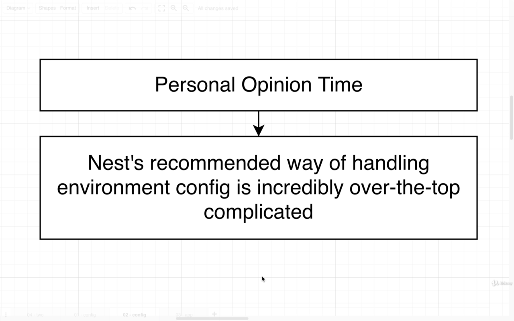

### Go to next Section to read more

---

## **[⬆ Back to Top](#table-of-contents)**

---

# `Section-14: Managing App Configuration`

### 1- Install @nestjs/config npm package

```bash
$ npm install @nestjs/config
```


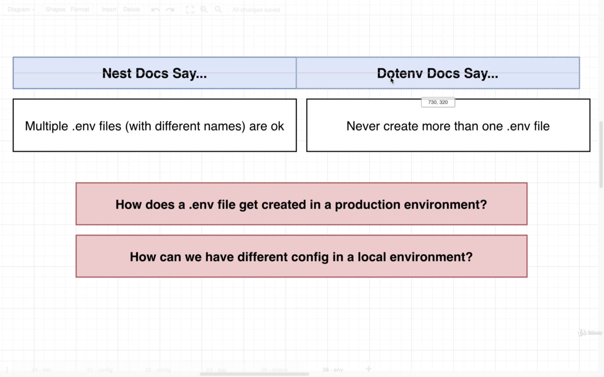

Stephen Grider Says:

> ## Let me tell you what you and I are going to do. We're going to kind of forget the rules set up by the Dotenv docs people, we're not going to very strictly follow their rules. Instead, we're going to take the Nest recommendation. We are going to have more than one different file. We're going to have one specifically to be used during development of our application and one during testing of our application. So these different files are going to provide some different database names for this database property right here. We'll have one file. It says use a database name of DB_SQLITE. And then the other file will say use a database name of something like Test.SQLite or something like that. So, again, we are not strictly following the recommendations of env dOCS because I don't know, I'm just not really a big fan of that library myself, as you can tell, with all this invariant configuration stuff.

## Create two files:

1. ### .env.development
1. ### .env.test

### Then make your database configuration based on environment

```ts

import { ConfigModule, ConfigService } from '@nestjs/config';

@Module({
  imports: [
    // Global your config variables.
    // choose which file compiler use based on NODE_ENV variable.
    ConfigModule.forRoot({
      isGlobal: true,
      envFilePath: `.env.${process.env.NODE_ENV}`,
    }),

    // Add ConfigService to dependency container of typeorm module.
    TypeOrmModule.forRootAsync({
      inject: [ConfigService],
      useFactory: (config: ConfigService) => {
        return {
          type: 'sqlite',
          database: config.get<string>('DB_NAME'),
          entities: [User, Report],
          synchronize: true,
        };
      },
    }),
    // Comment out this part.
    // TypeOrmModule.forRoot({
    //   type: 'sqlite',
    //   database: process.env.NODE_ENV === 'test' ? 'test.sqlite' : 'db.sqlite',
    //   entities: [User, Report],
    //   synchronize: true,
    // }),
    ...,
  ],
  ...
})

```

## **[⬆ Back to Top](#table-of-contents)**

---

# `Section-15: Relations with TypeORM`

## Requires Knowledge for Associations:

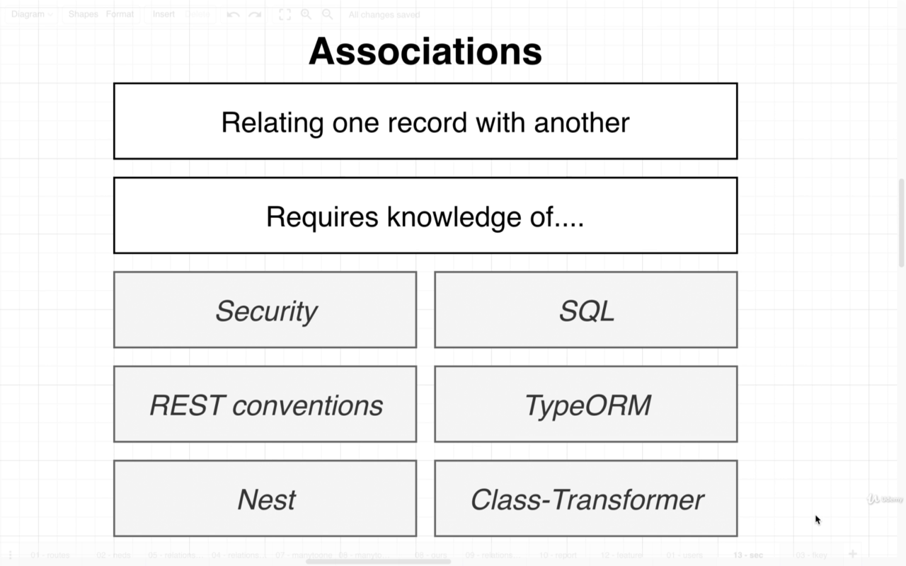
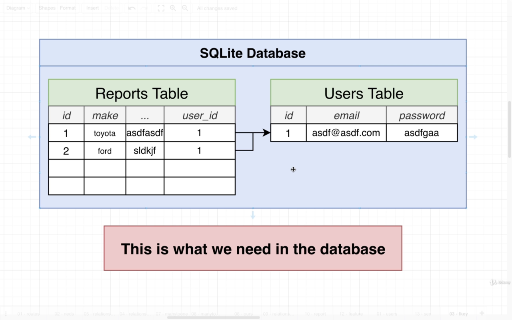

## Steps to create an association in nestjs and typeorm:

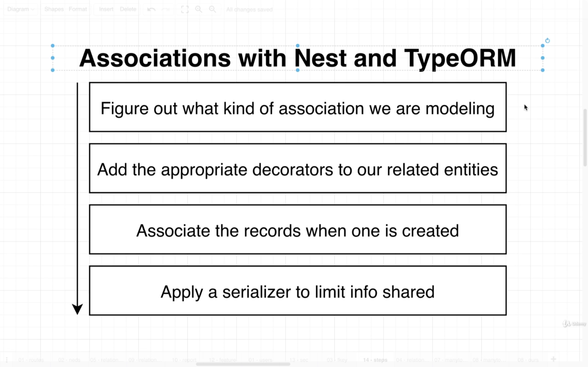

## Types of Relationships:

## One-to-One Relationship:

### It’s a relationship where a record in one entity (table) is associated with exactly one record in another entity (table).

- Country - capital city: Each country has exactly one capital city. Each capital city is the capital of exactly one country.

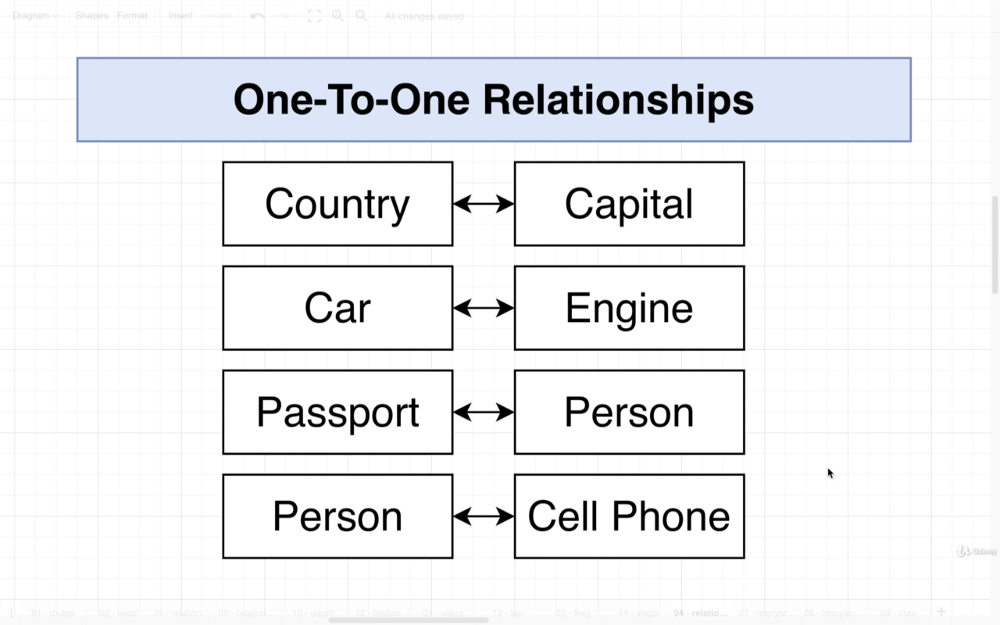

## One-to-many / Many-to-one Relationship:

### This kind of relationship means that one row in a table (usually called the parent table) can have a relationship with many rows in another table (usually called child table).

- One customer may make several purchases, but each purchase is made by a single customer.

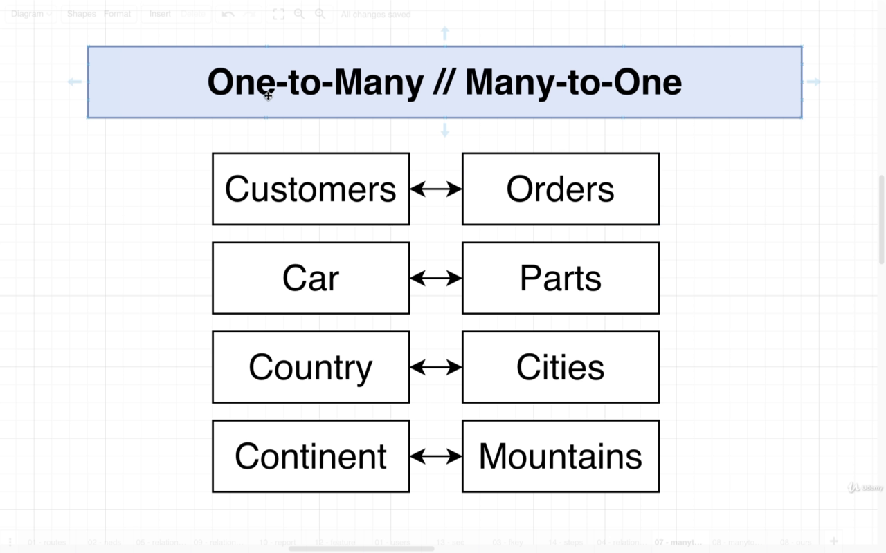

## Many-to-Many Relationship:

### By definition, a many-to-many relationship is where more than one record in a table is related to more than one record in another table.

- A typical example of a many-to many relationship is one between students and classes. A student can register for many classes, and a class can include many students.

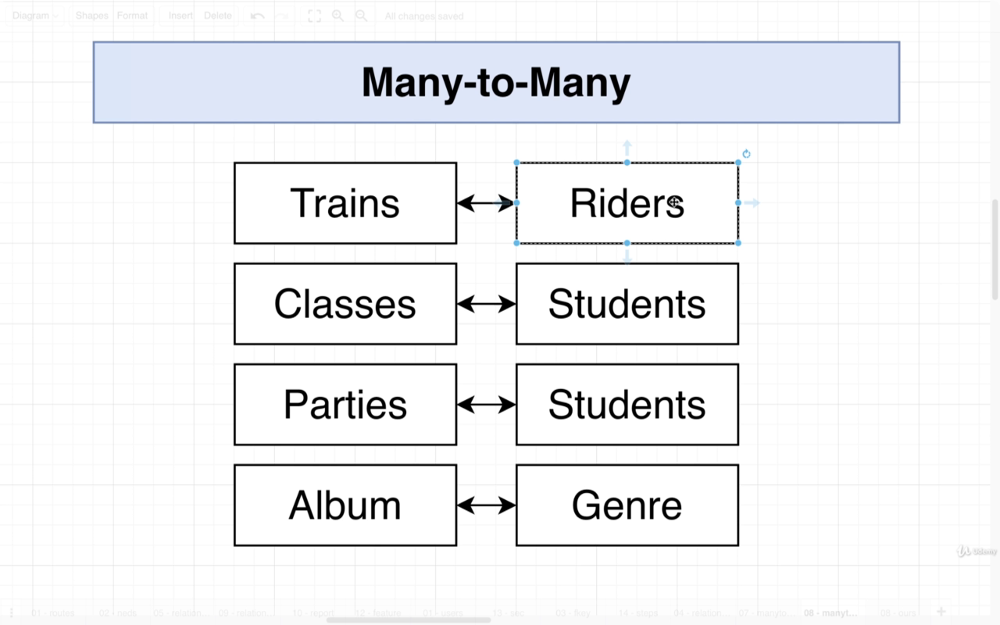

---

## Our App: Relationship between Reports and users:

### One to many relationship.


### OneToMany and ManyToOne Decorators.


```ts
// in user.entity.ts
// Doesn't make a change in our Database

class User {
  @OneToMany(() => Report, (report) => report.user)
  reports: Report[];
}
```

```ts
// in report.entity.ts
// Create user_id column in reports table in Database.

class Report {
  @ManyToOne(() => User, (user) => user.reports)
  user: User;
}
```

```ts
// in reports.service.ts

export class ReportsService {
  create(reportDto: CreateReportDto, user: User) {
    const report = this.repo.create(reportDto);
    report.user = user; // assign user to the report
    return this.repo.save(report);
  }
}
```

```ts
// in reports.controller.ts

@Controller("reports")
export class ReportsController {
  @Post()
  @UseGuards(AuthGuard)
  @Serialize(ReportDto)
  // to hide some information of user.: Serialize it --> hide password property
  createReport(@Body() body: CreateReportDto, @CurrentUser() user: User) {
    return this.reportsService.create(body, user);
  }
}
```

> ManyToOne: Create user_id column in reports table in Database.


### **Important** you should read these articles:

- [I cannot understand the syntax of callback passed to the TypeORM Relations decorator](https://stackoverflow.com/questions/66409746/i-cannot-understand-the-syntax-of-callback-passed-to-the-typeorm-relations-decor)
- [Circular Dependency TS Issue](https://github.com/Microsoft/TypeScript/issues/20361)
- [Circular Type References in TypeScript](https://stackoverflow.com/questions/24444436/circular-type-references-in-typescript)

## **[⬆ Back to Top](#table-of-contents)**

---
