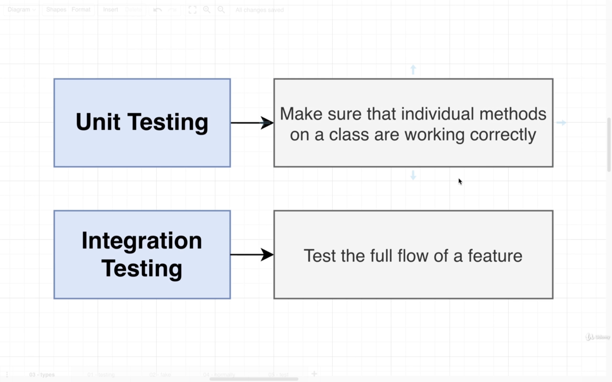
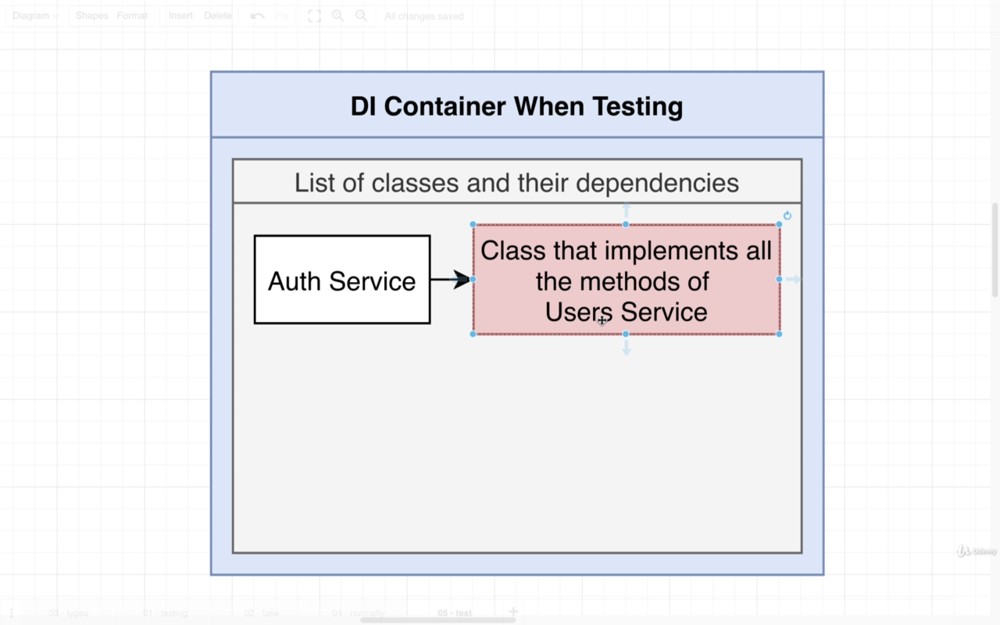
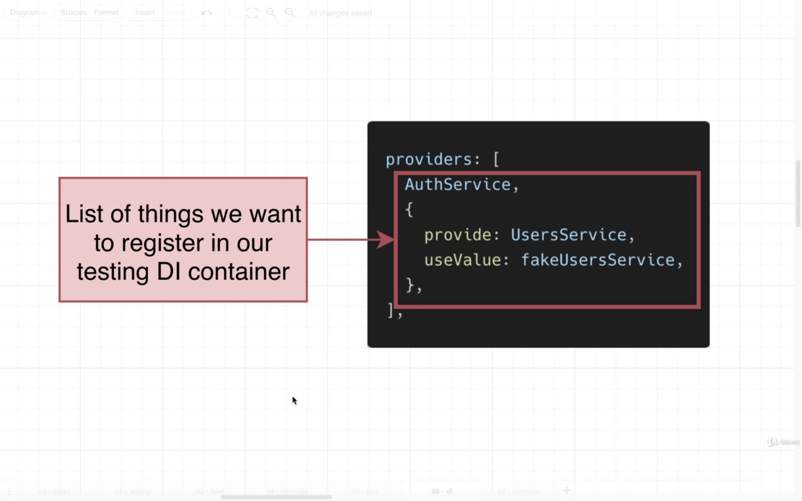

# `Section-7: Car Value Project`

# Project Structure


# `Section-8-9: Persisting Data with TypeORM in Nest`


## How to create an entity ?


```ts
//1) create user.entity.ts

import { Entity, Column, PrimaryGeneratedColumn } from 'typeorm';

@Entity()
export class User {
  @PrimaryGeneratedColumn()
  id: number;

  @Column()
  email: string;

  @Column()
  password: string;
}
```

```ts
//2) update users.module.ts
+ import { TypeOrmModule } from '@nestjs/typeorm';
+ import { User } from './user.entity';
@Module({
  + imports: [TypeOrmModule.forFeature([User])],
})
export class UsersModule {}
```

```ts
//3) update parent: app.module.ts
+ import { User } from './users/user.entity';
@Module({
  imports: [
    TypeOrmModule.forRoot({
      type: 'sqlite',
      database: 'db.sqlite',
    + entities: [User],
      synchronize: true,
    }),
    UsersModule,
    ReportsModule,
  ],
  controllers: [AppController],
  providers: [AppService],
})
export class AppModule {}
``
```

## `TypeOrm: Repository Api`

> More about: [Repository Api](https://typeorm.io/repository-api)


## `How to call the repository api and dependency injection in our service ?`


```ts
//1) Update users.service.ts

+ import { Repository } from 'typeorm';
+ import { InjectRepository } from '@nestjs/typeorm';
+ import { User } from './user.entity';

@Injectable()
export class UsersService {
  + constructor(@InjectRepository(User) private repo: Repository<User>) {}
  //this @InjectRepository(User) for purpose of dependency injection with generics.

  create(email: string, password: string) {
    const user = this.repo.create({ email, password });
    return this.repo.save(user);
  }
}

//2) Update users.controller.ts

+ import { UsersService } from './users.service';

@Controller('auth')
export class UsersController {
  + constructor(private usersService: UsersService) {}
  @Post('/signup')
  createUser(@Body() body: CreateUserDto) {
    + this.usersService.create(body.email, body.password);
  }
}

```

> No hooks works in save api.


# `Section 10 - Custom Data Serialization`

### How to hide data in Nest

#### 1- Nest Recommended Solution

1. In 'user.entity.ts'

```ts
+ import { Exclude } from 'class-transformer';
```

```ts
  // Add Exclude Decorator to the field that it must be hidden.
  + @Exclude()
  @Column()
  password: string;
```

2. In 'user.controller.ts'

```ts
import { UseInterceptors, ClassSerializerInterceptor } from '@nestjs/common';
```

```ts
// Add this decorator in your route.
+ @UseInterceptors(ClassSerializerInterceptor)
  @Get('/:id')
  async findUser(@Param('id') id: string) {
    const user = await this.usersService.findOne(+id);
    if (!user) {
      throw new NotFoundException('User not found');
    }
    return user;
  }

```

#### 2- More Complicated (much more flexible) Solution.

> [What's the difference between Interceptor vs Middleware vs Filter in Nest.js?](https://stackoverflow.com/questions/54863655/whats-the-difference-between-interceptor-vs-middleware-vs-filter-in-nest-js)


##### Our First Interceptor

> create new interceptor 'serialize.interceptor.ts'

```ts
import {
  UseInterceptors,
  NestInterceptor,
  ExecutionContext,
  CallHandler,
} from '@nestjs/common';
import { Observable } from 'rxjs';
import { map } from 'rxjs/operators';
import { plainToClass } from 'class-transformer';

export class SerializeInterceptor implements NestInterceptor {
  intercept(
    context: ExecutionContext,
    handler: CallHandler<any>,
  ): Observable<any> | Promise<Observable<any>> {
    return handler.handle().pipe(
      map((data: any) => {
        return plainToInstance(this.dto, data, {
          excludeExtraneousValues: true,
        });
      }),
    );
  }
}
```

> create new decorator to make use of our interceptor

```ts
export function Serialize(dto: any) {
  return UseInterceptors(new SerializeInterceptor(dto));
}
```

> Use it in our route or, or in our controller

```ts
@Serialize(UserDto)
@Get('/:id')
findUser(){}
```

### `How to make decorator accepts a class only ? (type safety)`

> to avoid this @Serialize('Hello World')
>
> > Use interface for class definition

```ts
interface ClassConstructor {
  new (...args: any[]): {};
}
function Serialize(dto: ClassConstructor){...}
```

# `Section-11: Authentication From Scratch`

### Create new Service 'Auth Service' to split out the authentication process from user service.

#### This is the module after adding Auth Service.


> Create a new service class and inject it to the module 'auth.service.ts'
>
> > Then it will be able to use UserService as a di.

```ts
// auth.service.ts

import { Injectable } from '@nestjs/common';

@Injectable()
export class AuthService {
  constructor(private usersService: UsersService) {}
}
```

```ts
// users.module.ts
@Module({
  + providers: [UsersService, AuthService],
})
export class UsersModule {}
```

### Signup flow : Hashing password with Salt.


> Signup functionality in the auth service class.

```ts
export class AuthService {
  async signup(email: string, password: string) {
    // Check if user email in use
    const users = await this.usersService.find(email);
    if (users.length) {
      throw new BadRequestException('This email is already use.');
    }

    // Hash the user password
    // First: Generate the Salt
    const salt = randomBytes(8).toString('hex');

    // Hash the salt and the password together using scrypt function as a buffer.
    const hash = (await scrypt(password, salt, 32)) as Buffer;

    // Join the hashed result and the salt together.
    // you will split it in the sign in function to get the salt and hash.
    // then with the login password you will hash it again with the given salt.
    // then compare them if they equal = Authenticated user.
    const result = `${salt}.${hash.toString('hex')}`;

    // Create a new user and save it
    const user = await this.usersService.create(email, result);

    // return created user.
    return user;
  }

  async signin(email: string, password: string) {
    // Check if user email exist.
    const [user] = await this.usersService.find(email);
    if (!user) {
      throw new BadRequestException('This email not exist.');
    }

    // Check if password is correct.
    const [salt, storedHash] = user.password.split('.');
    const hash = (await scrypt(password, salt, 32)) as Buffer;
    if (storedHash !== hash.toString('hex')) {
      throw new BadRequestException('Wrong Password.');
    }

    return user;
  }
}
```

## Common Auth System Features.


### How to create your own custom Param Decorator

```ts
import { createParamDecorator, ExecutionContext } from '@nestjs/common';

export const CurrentUser = createParamDecorator(
  (data: any, context: ExecutionContext) => {
    return 'Current User Custom Decorator';
  },
);
```

### Now, to make a Decorator to use to get current user, we need two things

1. Session object to get the current userId, easy with context object.
1. UserService class to get access to repo, hard because the dependency injection system.


### `Solution for this problem: Create an Interceptor to hold those things, and make it inside di container and then decorator can use it.`


## How to connect our create-user interceptor to controllers

### 1- Controller Scoped.

> ### Hint, Very tedious if we will use this interceptor in more than one controller.


## Steps:

> 1- Create Interceptor to add the current user to the request.

```ts
import {
  NestInterceptor,
  ExecutionContext,
  CallHandler,
  Injectable,
} from '@nestjs/common';
import { Observable } from 'rxjs';
import { UsersService } from '../users.service';

@Injectable()
export class CurrentUserInterceptor implements NestInterceptor {
  constructor(private userService: UsersService) {}
  async intercept(
    context: ExecutionContext,
    handler: CallHandler,
  ): Promise<Observable<any>> {
    const request = context.switchToHttp().getRequest();
    const { userId } = request.session;

    if (userId) {
      const user = await this.userService.findOne(+userId);
      request.currentUser = user;
    }

    return handler.handle();
  }
}
```

> 2- Inject the interceptor to the providers of 'users.module.ts'

```ts
//users.module.ts
@Module({
  ...,
  providers: [..., CurrentUserInterceptor],
});
```

> 3- Use the interceptor in our controller.

```ts
//users.controller.ts
@UseInterceptors(CurrentUserInterceptor)
export class UsersController {}
```

### 2- Globally Scoped.

> ### Only single instance to all controllers.


#### How to apply it globally?

```ts
// in users.module.ts

+ import { APP_INTERCEPTOR } from '@nestjs/core';

@Module({
  ...,
  providers: [
    ...,
    {
      provide: APP_INTERCEPTOR,
      useClass: CurrentUserInterceptor,
    },
  ],
})
export class UsersModule {}
```

---

## How to make a `Guard`: to reject requests to certain handlers if the user is not signed in.


### As well as interceptors: we can apply guard in different locations:

1. Globally for all controllers.
1. Controller scope.
1. Single Handler Scope.


### Steps to make our AuthGuard.

> 1- Make your guard dir, and create 'auth.guard.ts'

```ts
import {
  CanActivate,
  ExecutionContext,
  UnauthorizedException,
} from '@nestjs/common';

export class AuthGuard implements CanActivate {
  canActivate(context: ExecutionContext) {
    const request = context.switchToHttp().getRequest();
    const { userId } = request.session;

    if (!userId) {
      throw new UnauthorizedException(
        'Your are not authorized for this resource.',
      );
    }

    return userId;
  }
}
```

> 2- In our controller:

```ts
import { UseGuards } from '@nestjs/common';
import { AuthGuard } from '../guards/auth.guard';
// @UseGuards(AuthGuard) // apply guard for controller
export class UsersController {
  @Get('/whoami')
  @UseGuards(AuthGuard) // apply guard for single handler
  whoAmI(@CurrentUser() user: User) {
    return user;
  }
}
```

---

# `Section-12: Unit Testing`



## To make test of our 'Auth Service' functionality (signup, signin) we should have:

1. A Copy of UsersService to use [find(), create()].
1. The UsersService depends on 'UsersRepo', So it should have copy of it.
1. The UsersRepo depends on 'SQLITE' and its configuration.


## To make our test more straightforward we will use a trick

### We're going to use the `dependency injection` system to avoid having to create all these different dependencies.

### `Create your own fake 'UsersService'`




```ts
import { Test } from '@nestjs/testing';
import { AuthService } from './auth.service';
import { User } from './user.entity';
import { UsersService } from './users.service';

it('can create an instance of auth service', async () => {
  //Create a fake copy of users service.
  const fakeUsersService: Partial<UsersService> = {
    find: () => Promise.resolve([]),
    create: (email: string, password: string) =>
      Promise.resolve({ id: 1, email, password } as User),
  };
  const module = await Test.createTestingModule({
    providers: [
      AuthService,
      {
        provide: UsersService,
        useValue: fakeUsersService,
      },
    ],
  }).compile();

  const service = module.get(AuthService);

  expect(service).toBeDefined();
});
```




---

# `Section-13: Integration Testing`


### To solve the problem of : 'Test module cannot use session or pipe because these are created in main.ts file not in the app module... We can do this: '

> ## First the ValidationPipe.

1. ### Remove uses in the main.ts file

```ts
// Remove this block of code in bootstrap function >> main.ts
app.useGlobalPipes(
  new ValidationPipe({
    whitelist: true,
  }),
);
```

2. ### Add new provider in AppModule file.

```ts
import { ValidationPipe } from '@nestjs/common';
import { APP_PIPE } from '@nestjs/core';

providers: [
    ...,
    {
      provide: APP_PIPE,
      useValue: new ValidationPipe({ whitelist: true }),
    },
  ],
```

> ## Second, Globally Scoped Middleware: 'Cookie-Session'.

1. ### Remove uses in the main.ts file

```ts
// Remove this block of code in bootstrap function >> main.ts
app.use(
  cookieSession({
    keys: ['secret-key'],
  }),
);
```

2. ### Create new method in AppModule Class.

```ts
export class AppModule {
  configure(consumer: MiddlewareConsumer) {
    consumer.apply(cookieSession({ keys: ['secret-key'] })).forRoutes('*');
  }
}
```

### `Create two versions of our DB , one for development and another one for testing.`


> #### You can solve this by using NODE_ENV variable to identify which environment you work on.

```ts
    TypeOrmModule.forRoot({
      type: 'sqlite',
    + database: process.env.NODE_ENV === 'test' ?
      'test.sqlite' : 'db.sqlite',
      ...
    }),
```

## Recommended Solution: Environment Config.


### Go to next Section to read more

---

# `Section-14: Managing App Configuration`

### 1- Install @nestjs/config npm package

```bash
$ npm install @nestjs/config
```


Stephen Grider Says:

> ## Let me tell you what you and I are going to do. We're going to kind of forget the rules set up by the Dotenv docs people, we're not going to very strictly follow their rules. Instead, we're going to take the Nest recommendation. We are going to have more than one different file. We're going to have one specifically to be used during development of our application and one during testing of our application. So these different files are going to provide some different database names for this database property right here. We'll have one file. It says use a database name of DB_SQLITE. And then the other file will say use a database name of something like Test.SQLite or something like that. So, again, we are not strictly following the recommendations of env dOCS because I don't know, I'm just not really a big fan of that library myself, as you can tell, with all this invariant configuration stuff.

## Create two files:

1. ### .env.development
1. ### .env.test

### Then make your database configuration based on environment

```ts

import { ConfigModule, ConfigService } from '@nestjs/config';

@Module({
  imports: [
    // Global your config variables.
    // choose which file compiler use based on NODE_ENV variable.
    ConfigModule.forRoot({
      isGlobal: true,
      envFilePath: `.env.${process.env.NODE_ENV}`,
    }),

    // Add ConfigService to dependency container of typeorm module.
    TypeOrmModule.forRootAsync({
      inject: [ConfigService],
      useFactory: (config: ConfigService) => {
        return {
          type: 'sqlite',
          database: config.get<string>('DB_NAME'),
          entities: [User, Report],
          synchronize: true,
        };
      },
    }),
    // Comment out this part.
    // TypeOrmModule.forRoot({
    //   type: 'sqlite',
    //   database: process.env.NODE_ENV === 'test' ? 'test.sqlite' : 'db.sqlite',
    //   entities: [User, Report],
    //   synchronize: true,
    // }),
    ...,
  ],
  ...
})

```

# `Section-15: Relations with TypeORM`

## Requires Knowledge for Associations:


## Steps to create an association in nestjs and typeorm:


## Types of Relationships:

## One-to-One Relationship:

### It’s a relationship where a record in one entity (table) is associated with exactly one record in another entity (table).

- Country - capital city: Each country has exactly one capital city. Each capital city is the capital of exactly one country.


## One-to-many / Many-to-one Relationship:

### This kind of relationship means that one row in a table (usually called the parent table) can have a relationship with many rows in another table (usually called child table).

- One customer may make several purchases, but each purchase is made by a single customer.


## Many-to-Many Relationship:

### By definition, a many-to-many relationship is where more than one record in a table is related to more than one record in another table.

- A typical example of a many-to many relationship is one between students and classes. A student can register for many classes, and a class can include many students.


---

## Our App: Relationship between Reports and users:

### One to many relationship.


### OneToMany and ManyToOne Decorators.


```ts
// in user.entity.ts
// Doesn't make a change in our Database

class User {
  @OneToMany(() => Report, (report) => report.user)
  reports: Report[];
}
```

```ts
// in report.entity.ts
// Create user_id column in reports table in Database.

class Report {
  @ManyToOne(() => User, (user) => user.reports)
  user: User;
}
```

```ts
// in reports.service.ts

export class ReportsService {
  create(reportDto: CreateReportDto, user: User) {
    const report = this.repo.create(reportDto);
    report.user = user; // assign user to the report
    return this.repo.save(report);
  }
}
```

```ts
// in reports.controller.ts

@Controller('reports')
export class ReportsController {
  @Post()
  @UseGuards(AuthGuard)
  @Serialize(ReportDto)
  // to hide some information of user.: Serialize it --> hide password property
  createReport(@Body() body: CreateReportDto, @CurrentUser() user: User) {
    return this.reportsService.create(body, user);
  }
}
```

> ManyToOne: Create user_id column in reports table in Database.


### **Important** you should read these articles:

- [I cannot understand the syntax of callback passed to the TypeORM Relations decorator](https://stackoverflow.com/questions/66409746/i-cannot-understand-the-syntax-of-callback-passed-to-the-typeorm-relations-decor)
- [Circular Dependency TS Issue](https://github.com/Microsoft/TypeScript/issues/20361)
- [Circular Type References in TypeScript](https://stackoverflow.com/questions/24444436/circular-type-references-in-typescript)
