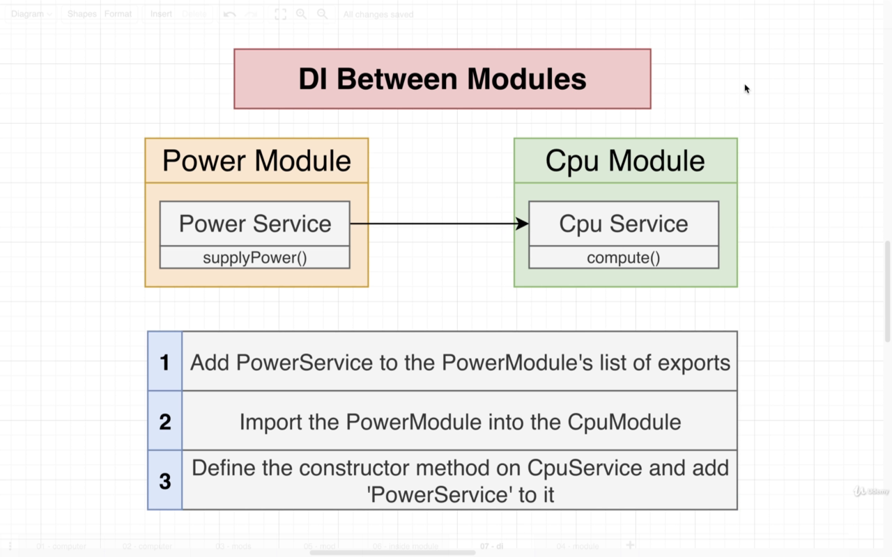

# `Section-6: Modules, Dependency Injection`

# Project Structure


## 1- Create Nest Project

```bash
$ nest new di
```

## 2-Generate four modules by cli: [computer, cpu, power, disk]

```bash
$ nest genrate module $(name)
```

## 3-Generate three services by cli: [cpu, power, disk]

```bash
$ nest genrate service $(name)
```

## 4-Generate The computer controller

```bash
$ nest genrate controller computer
```

# `Share code between different modules.`


## `DI inside one single module`


## `DI between different modules`



## `Wrap Up`


