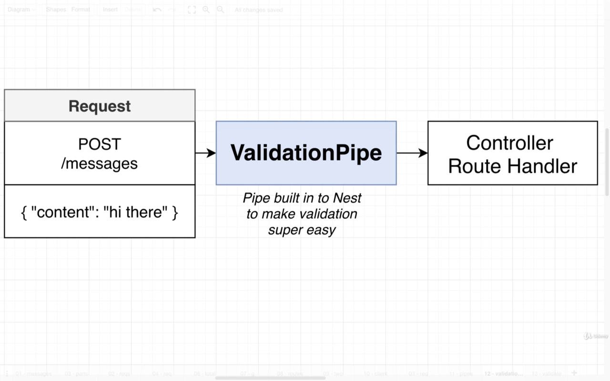

# `NEST CLI: CRUD generator`

# 1- Create Nest Project

```bash
$ nest new <name> [options]
// <name>	The name of the new project
```

- Generate a module **`(nest g mo)`** to keep code organized and establish clear boundaries (grouping related components)
- Generate a controller **`(nest g co)`** to define CRUD routes (or queries/mutations for GraphQL applications)
- Generate a service **`(nest g s)`** to implement & isolate business logic
- Generate an entity class/interface to represent the resource data shape
- Generate Data Transfer Objects (or inputs for GraphQL applications) to define how the data will be sent over the network

# Pipes

## Validation Pipe



## Automatic Validation


## `Finally to use pipe to validate body data in our project, we have some small steps:`

- Tell nest to use global validation, HOW?

  ```ts
  import { ValidationPipe } from '@nestjs/common';
  app.useGlobalPipes(new ValidationPipe());
  ```

  > > in 'main.ts' file we import ValidationPipe from common. then we use it inside bootstrap function:

- Create A DTO Class inside dtos folder for required validation: Call it for example: "CreateMessageDto" and use some npm packages [class-validator](https://github.com/typestack/class-validator) and [class-transformer](https://github.com/typestack/class-transformer) to make use of decorators to validate your fields.

  ```ts
  # dtos/create-message-dto.ts
  import { IsString } from 'class-validator';
  export class CreateMessageDto {
    @IsString()
    content: string;
  }
  ```

- Inside your controller go to the post method and make the body to be a dto object .

  ```ts
  import { CreateMessageDto } from './dtos/create-message-dto';
  @Post()
    createMessage(@Body() body: CreateMessageDto) {
      console.log(body);
    }
  ```
