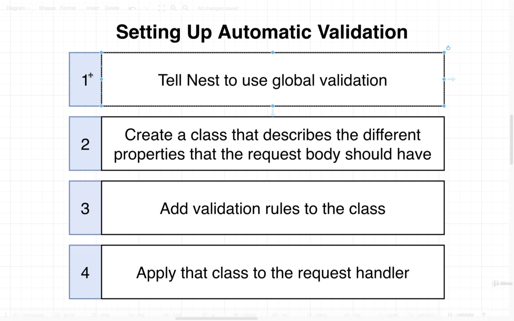

# `NEST CLI: CRUD generator`

# 1- Create Nest Project

```bash
$ nest new <name> [options]
// <name>	The name of the new project
```

- Generate a module **`(nest g mo)`** to keep code organized and establish clear boundaries (grouping related components)
- Generate a controller **`(nest g co)`** to define CRUD routes (or queries/mutations for GraphQL applications)
- Generate a service **`(nest g s)`** to implement & isolate business logic
- Generate an entity class/interface to represent the resource data shape
- Generate Data Transfer Objects (or inputs for GraphQL applications) to define how the data will be sent over the network

# Pipes

## Validation Pipe


## Automatic Validation



## `Finally to use pipe to validate body data in our project, we have some small steps:`

- Tell nest to use global validation, HOW?

  ```ts
  import { ValidationPipe } from '@nestjs/common';
  app.useGlobalPipes(new ValidationPipe());
  ```

  > > in 'main.ts' file we import ValidationPipe from common. then we use it inside bootstrap function:

- Create A DTO Class inside dtos folder for required validation: Call it for example: "CreateMessageDto" and use some npm packages [class-validator](https://github.com/typestack/class-validator) and [class-transformer](https://github.com/typestack/class-transformer) to make use of decorators to validate your fields.

  ```ts
  # dtos/create-message-dto.ts
  import { IsString } from 'class-validator';
  export class CreateMessageDto {
    @IsString()
    content: string;
  }
  ```

- Inside your controller go to the post method and make the body to be a dto object .

  ```ts
  import { CreateMessageDto } from './dtos/create-message-dto';
  @Post()
    createMessage(@Body() body: CreateMessageDto) {
      console.log(body);
    }
  ```

---

# Difference between Service and Repository


- Read this

  - [NestJS with TypeORM: When using custom repository, is a service needed anymore?](https://stackoverflow.com/questions/52030009/nestjs-with-typeorm-when-using-custom-repository-is-a-service-needed-anymore)
  - [Implementing a Generic Repository Pattern Using NestJS
    ](https://betterprogramming.pub/implementing-a-generic-repository-pattern-using-nestjs-fb4db1b61cce)

---

## ` Dependency Injection in our project between (controller-service-repository)`

> Never Do this
>
> > **BAD**: Message Service creates its own copy of MessagesRepository

```ts
export class MessagesService {
  messagesRepo: MessagesRepository;
  constructor() {
    // DO NOT DO THAT in real apps: use Dependency Injection
    this.messagesRepo = new MessagesRepository();
  }
}
```

> **Lets Solve this with Dependency Injection.**


> Instead, Do this
>
> > **Better**: MessagesService receives its dependency.

```ts
export class MessagesService {
  messagesRepo: MessagesRepository;
  constructor(repo: MessagesRepository) {
    this.messagesRepo = repo;
  }
}
```

# BEST SOLUTION: REPOSITORY PATTERN

> Read this First: [Implementing a Generic Repository Pattern Using NestJS](https://betterprogramming.pub/implementing-a-generic-repository-pattern-using-nestjs-fb4db1b61cce)

> MessagesService receives its dependency, and it doesn't specifically required 'Message Repository' you can change your datasource in a flexible way.

```ts
interface Repository {
  findOne(id: string);
  findAll();
  create(content: string);
}
export class MessagesService {
  messagesRepo: Repository;
  constructor(repo: Repository) {
    this.messagesRepo = repo;
  }
}
```


## Few more notes about DI

- ` Stephen Grider says:`

> last thing I want to touch on is the fact that as you start to look at this code, you might really start to say, what is the benefit? What have we really gained here? What is the big benefit to all the stuff we've done? Who cares about using dependency injection? Well, to be honest with you, sometimes I kind of agree with you not going to lie. Sometimes in invest making use of dependency injection feels like we are just kind of jumping through extra hoops without really gaining a whole lot.

> So if you feel that way, totally fine. But I can't tell you without a doubt, is that testing your application when you're making use of dependency injection and its entire inversion of control technique, testing your app is going to be far easier, a lot easier. So eventually when we start writing tests around our application, we're going to see that testing individual classes inside of our app is going to be very simple and straightforward compared to if we were not making use of inversion of control and dependency injection. So just keep in mind that is really the payout. The payout of all this stuff is once we start writing tests. So that's kind of got a corollary to it, I'm assuming that you are interested in testing and you want to do testing.
